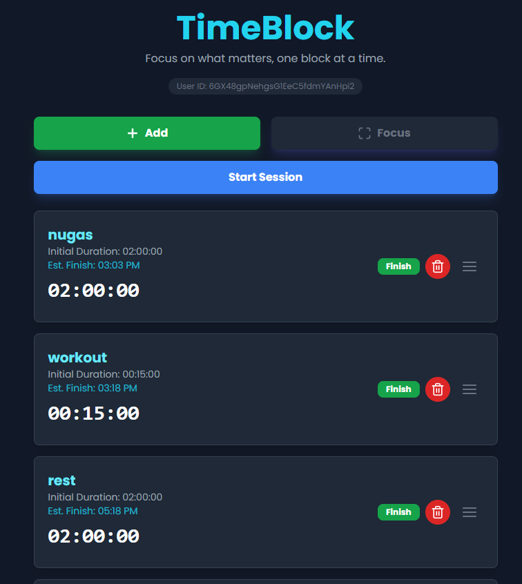

# ⏱️ TimeBlock

**TimeBlock** adalah web app sederhana untuk menerapkan metode **time blocking** agar aktivitas harian lebih terstruktur dan terencana.

User bisa menambahkan aktivitas beserta durasinya, lalu sistem akan menghitung **estimasi waktu selesai setiap aktivitas** secara otomatis. Dengan begitu, lo bisa langsung tahu kira-kira **jam berapa setiap tugas akan selesai** dan bisa merencanakan hari dengan lebih jelas.

---

## 🚀 Live Preview

> https://revanyangel.github.io/TimeBlockingApp/

  

---

## ✨ Features

### 📋 Activity Management (CRUD)
User bisa mengelola aktivitas dengan fitur lengkap:

- ➕ **Create** – menambahkan aktivitas baru dengan durasi tertentu  
- ✏️ **Update** – mengubah nama aktivitas atau durasi  
- 🗑️ **Delete** – menghapus aktivitas  
- ✅ **Finish** – menandai aktivitas sebagai selesai

---

### ⏳ Automatic Time Estimation

Saat session dimulai, aplikasi akan:

- Menghitung **estimasi waktu selesai tiap aktivitas**
- Menampilkan **jam selesai secara otomatis**
- Membantu user melihat alur kegiatan dari awal sampai akhir hari

---

### 🎯 Focus Mode

Fitur **Focus Mode** dibuat supaya user bisa benar-benar fokus pada aktivitas yang sedang berjalan.

Saat tombol **Focus** diklik:

- Tampilan berubah menjadi **full screen focus view**
- Menampilkan **countdown timer** dari aktivitas yang sedang berlangsung
- Mengurangi distraksi dari aktivitas lain

---

### 🔄 Auto-Flexible Task Reordering

Jika sebuah aktivitas sudah selesai:

- Aktivitas tersebut akan **otomatis dipindahkan ke bagian bawah**
- Masuk ke **area tugas non-aktif**
- Membuat daftar tugas aktif tetap rapi dan fokus pada task yang belum selesai
- Semua task bisa di atur urutan nya hanya dengan menggesernya saja

---

## 🚀 How It Works

1. Tambahkan aktivitas yang ingin dilakukan
2. Tentukan **durasi aktivitas**
3. Klik **Start Session**
4. Sistem akan menghitung:
   - countdown timer
   - estimasi waktu selesai tiap aktivitas
5. Selesaikan aktivitas satu per satu

---

## 🎯 Purpose

Aplikasi ini dibuat untuk membantu user:

- Mengatur waktu dengan metode **time blocking**
- Mengetahui **timeline aktivitas harian**
- Mengurangi kebiasaan multitasking
- Fokus menyelesaikan **satu aktivitas dalam satu waktu**